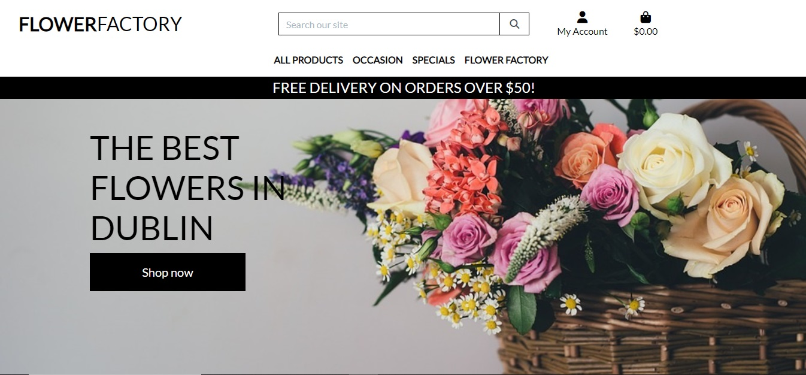

<h1 align="center">Flower Factory</h1>

[View the live project here.](https://flower-factory.herokuapp.com/)

This website is associated with an imaginary business called Flaower Factory, a florist based in Dublin. The website is fully functioning as an E-commerce application used to enable potential customers to order products online and pay for their orders. It is designed to be responsive and accessible on a range of devices, making it easy to navigate for potential partners. A B2C (business to customer) model was used in building this website. The business offers oline orders and delivery so it was important to give details of the products and include images to gain customers trust. The application is based on a single payment model as customers pay for single purchases they make online. Due to low budget, our marketing strategy was confined to only two types, Facebook page and email news letter. cutomers can follow us on Facebook to hear our stories and posts. They can also subscribe to our news letter where they can stay in touch and recieve
the latest offers and updates. When you visist the websit, the landing page has simple and clear structure.
you can easily find the shop now button or search for products. The nave bar has links to all the pages on the application which can be also found on the footer section. The footer has also links to the social media websits, in addition to a link to subscribe to the newsletter. The shopping pages have details of the products including prices, rate, description and images. The aboutus page has aticles about the business and its story. The blog page has some articles where customers can comment and get engaged. The contact page allows customer to contact the business owner directly throw dropping a message in a contact form. The subscription page anable customers to subscribe to the mail list where they receive emails about deals and updates.

<h2 align="center"></h2>

## User Experience (UX)

- ### User stories

  - #### customer main Goals

        1. As a customer, I want be able to easily navigate throughout the site to view products.
        2. As a customer, I want to be able to sellect products that I want to buy.
        3. As a customer, I want to be able to buy products onlne and pay for my purchase securely.
        4. As a customer, I want to easily register for an account and have personalised profile.

  - #### business owner main Goals

        1. As a business owner, I want to be able to list products,remove and adjust them.
        2. As a business owner, I want to view burchases.
        3. As a business owner, I want to view customers' messages in order to respond.

- ### Design

  - #### Colour Scheme
    - The two main colours used are black and white.
    -
  - #### Imagery
    - Imagery is important. The background image is suitable for the website. Images of all the products were uploaded to the website too.

## Features

- Responsive on all device sizes

- Interactive elements

## Technologies Used

### Languages Used

- [HTML5](https://en.wikipedia.org/wiki/HTML5)
- [CSS3](https://en.wikipedia.org/wiki/Cascading_Style_Sheets)
- [Python](<https://en.wikipedia.org/wiki/Python_(programming_language)>)
- [JavaScript](https://en.wikipedia.org/wiki/JavaScript)
- [Docker (software)](<https://en.wikipedia.org/wiki/Docker_(software)>)

### Frameworks, Libraries & Programs Used

1. [Django==3.2](<https://en.wikipedia.org/wiki/Django_(web_framework)>)
2. [Bootstrap 4.4.1:](https://getbootstrap.com/docs/4.4/getting-started/introduction/)
   - Bootstrap was used to assist with the responsiveness and styling of the website.
3. [Hover.css:](https://ianlunn.github.io/Hover/)
   - Hover.css was used on the Social Media icons in the footer to add the float transition while being hovered over.
4. [Google Fonts:](https://fonts.google.com/)
   - Google fonts were used to import the 'Titillium Web' font into the style.css file which is used on all pages throughout the project.
5. [Font Awesome:](https://fontawesome.com/)
   - Font Awesome was used on all pages throughout the website to add icons for aesthetic and UX purposes.
6. [jQuery:](https://jquery.com/)
   - jQuery came with Bootstrap to make the navbar responsive but was also used for the smooth scroll function in JavaScript.
7. [Git](https://git-scm.com/)
   - Git was used for version control by utilizing the Gitpod terminal to commit to Git and Push to GitHub.
8. [GitHub:](https://github.com/)
   - GitHub is used to store the projects code after being pushed from Git.
9. [Balsamiq:](https://balsamiq.com/)
   - Balsamiq was used to create the [wireframes](https://github.com/) during the design process.
10. [stripe](https://en.wikipedia.org/wiki/Stripe,_Inc.)
11. [mailchimp](https://mailchimp.com/)
12. [Heroku](https://en.wikipedia.org/wiki/Heroku)
13. [Amazon S3](https://en.wikipedia.org/wiki/Amazon_S3)
14. [PostgreSQL](https://en.wikipedia.org/wiki/PostgreSQL)

## Testing

- Manual testing was conducted to check all the functionalities of the website.
- The Website was tested on Google Chrome, Internet Explorer, Microsoft Edge and Safari browsers.
- The website was viewed on a variety of devices such as Desktop, Laptop and iPhone11.
- A large amount of testing was done to ensure that all pages were linking correctly.
- Friends and family members were asked to review the site and documentation to point out any bugs and/or user experience issues.

### Known Bugs

- All the functionalities look fine. However, it needs improvement in some areas. For example, The only way for the business owner to view messages coming form customers is to log into the admin site and check for messages. The same thing applies when the business owner wants to add stories in the Aboutus and Blog sections.

## Deployment

### GitHub Pages

The project was deployed to GitHub Pages using the following steps...

1. Log in to GitHub and locate the [GitHub Repository](https://github.com/)
2. At the top of the Repository (not top of page), locate the "Settings" Button on the menu.
   - Alternatively Click [Here](https://raw.githubusercontent.com/) for a GIF demonstrating the process starting from Step 2.
3. Scroll down the Settings page until you locate the "GitHub Pages" Section.
4. Under "Source", click the dropdown called "None" and select "Main Branch".
5. The page will automatically refresh.
6. Scroll back down through the page to locate the now published site [link](https://github.com) in the "GitHub Pages" section.

### Forking the GitHub Repository

By forking the GitHub Repository we make a copy of the original repository on our GitHub account to view and/or make changes without affecting the original repository by using the following steps...

1. Log in to GitHub and locate the [GitHub Repository](https://github.com/)
2. At the top of the Repository (not top of page) just above the "Settings" Button on the menu, locate the "Fork" Button.
3. You should now have a copy of the original repository in your GitHub account.

### Making a Local Clone

1. Log in to GitHub and locate the [GitHub Repository](https://github.com/)
2. Under the repository name, click "Clone or download".
3. To clone the repository using HTTPS, under "Clone with HTTPS", copy the link.
4. Open Git Bash
5. Change the current working directory to the location where you want the cloned directory to be made.
6. Type `git clone`, and then paste the URL you copied in Step 3.

```
git clone https://github.com/YOUR-USERNAME/YOUR-REPOSITORY
```

7. Press Enter. Your local clone will be created.

```
$ git clone https://github.com/YOUR-USERNAME/YOUR-REPOSITORY
> Cloning into `CI-Clone`...
> remote: Counting objects: 10, done.
> remote: Compressing objects: 100% (8/8), done.
> remove: Total 10 (delta 1), reused 10 (delta 1)
> Unpacking objects: 100% (10/10), done.
```

Click [Here](https://help.github.com/en/github/creating-cloning-and-archiving-repositories/cloning-a-repository#cloning-a-repository-to-github-desktop) to retrieve pictures for some of the buttons and more detailed explanations of the above process.

### Deployment to Heroku

- details of deployment to Heroku can be found [here](https://devcenter.heroku.com/articles/git#:~:text=To%20deploy%20your%20app%20to,heroku%20main%20Initializing%20repository%2C%20done.).

## Credits

### Code

- [Bootstrap4](https://getbootstrap.com/docs/4.4/getting-started/introduction/): Bootstrap Library was used throughout the project mainly to make site responsive using the Bootstrap Grid System.
- [Django==3.2](https://docs.djangoproject.com/en/4.2/releases/3.2/): Django Library was used throughout the project to make use of the buildin classes.

### Content

- The main structure of this project is based on boutique_ado_v1 project by Code Institute (<https://github.com/Code-Institute-Solutions/boutique_ado_v1>). However, it was amended to meet the goal of the new project in addition to adding new models and functunalities.

- The structure of the README.md was found [here](https://github.com/Code-Institute-Solutions/SampleREADME/blob/master/README.md)

### Media

- All Images were downloaded from [here](https://pixabay.com/images/search/bouquet%20flowers/).

### Acknowledgements

- My Mentor for continuous helpful feedback.

- Tutor support aand student care at Code Institute for their support.
